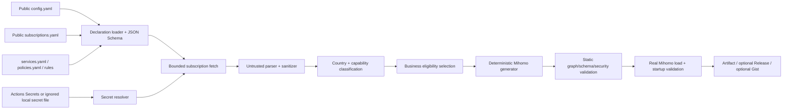

# clash-relay

[简体中文](README.zh-CN.md)

`clash-relay` is a deterministic, fail-closed Mihomo configuration builder designed for public reuse. A user declares subscription metadata and a small set of policy choices, injects subscription URLs only through GitHub Actions Secrets, and receives a standalone production `config.yaml` after static checks and real Mihomo validation.

The generated file is standard Mihomo YAML. FlClash is only a consumer; no Python process, database, local ASN database, daemon, or project-specific runtime is required on the client device.

> **Credential warning**
>
> A standalone Mihomo configuration contains the credentials of its inline proxy nodes. Never commit generated `config.yaml`. GitHub Release and Gist publishing are disabled by default and require explicit acknowledgements. On a public fork, treat workflow Artifacts as sensitive output. A private repository created from this project is the safer deployment choice.

## What problem this solves

Hand-written Mihomo configurations tend to mix subscription identity, node naming guesses, business routing, health checks, and publishing in one large YAML file. That creates accidental fallback, expensive-route leakage, inconsistent service copies, and releases that are difficult to test.

This project separates those concerns:

- subscription source metadata is public, but source URLs remain secret;
- node source and node capability are independent;
- service definitions and health probes are data-driven;
- public groups are small, while AUTO/provider groups remain hidden implementation details;
- empty pools reject or abort instead of borrowing unrelated nodes;
- candidate generation is deterministic;
- promotion is impossible until the exact candidate passes multiple real Mihomo cores.

## Architecture



Generated scheduling layers are:

```text
Public business group
  -> hidden SERVICE-FALLBACK
    -> hidden AUTO per country/region
      -> inline proxy-provider with health-check
        -> uniquely named proxy nodes
```

A pool with no eligible node never silently reaches another business pool. Optional pools point to `REJECT`; required pools stop the build.

See [Architecture](docs/architecture.md) for component boundaries and invariants.

## Five-minute start

### 1. Create your repository

Fork the code for evaluation, or create a private repository from it when the generated node credentials must remain private.

### 2. Create the two per-user public declarations

```bash
cp config.example.yaml config.yaml
cp subscriptions.example.yaml subscriptions.yaml
```

These two files contain policy and metadata only. They are safe to commit **only while they contain no URL, token, username, password, or private endpoint**.

Edit `subscriptions.yaml` so each source has a unique `id` and `secret_name`. There is no fixed subscription count.

### 3. Add one GitHub Actions Secret

Repository settings → Secrets and variables → Actions → New repository secret:

- Name: `CLASH_RELAY_SUBSCRIPTIONS`
- Value: a JSON or YAML mapping from each `secret_name` to its private URL.

```json
{
  "SUB_PRIMARY": "<subscription-url-from-provider>",
  "SUB_SPECIAL": "<optional-second-subscription-url>"
}
```

The workflow does not print this mapping. It is never written to generated YAML or reports.

### 4. Run the guarded production workflow

Commit `config.yaml` and `subscriptions.yaml` to `main`, or start **Generate, validate, and publish** manually. Until both canonical files exist, the template workflow exits successfully without resolving Secrets or creating a candidate.

### 5. Retrieve the result

The default publication is a versioned Actions Artifact named like:

```text
clash-relay-production-<run-number>-<commit-sha>
```

It contains the exact `config.yaml` that passed every stable-core job plus a redacted build report.

For a fixed update URL, explicitly enable GitHub Release publishing only after accepting that the asset is public:

```yaml
publishing:
  github_release:
    enabled: true
    allow_sensitive_public_release: true
```

Set both repository variables below; the acknowledgement value must be exact:

```text
PUBLISH_PUBLIC_RELEASE=true
CLASH_RELAY_PUBLICATION_ACKNOWLEDGEMENT=I_UNDERSTAND_THIS_PUBLISHES_PROXY_CREDENTIALS
```

The fixed asset URL is:

```text
https://github.com/OWNER/REPOSITORY/releases/latest/download/config.yaml
```

## Add any number of subscriptions

Every subscription is a data row, not a Python branch:

```yaml
version: 1
subscriptions:
  - id: workhorse
    display_name: Workhorse
    enabled: true
    required: true
    secret_name: SUB_WORKHORSE
    priority: 100
    on_error: fail
    allowed_uses: [general, ai, bulk]
    allowed_countries: [US, JP, SG, OTHER]
    default_capabilities: [general]
    default_cost_level: standard
    node_metadata: {}
    name_rules: []

  - id: special_routes
    display_name: Special routes
    enabled: true
    required: false
    secret_name: SUB_SPECIAL
    priority: 200
    on_error: skip
    allowed_uses: [residential, emby, high_multiplier, chain]
    allowed_countries: [US, JP, SG, OTHER]
    default_capabilities: []
    default_cost_level: premium
    node_metadata: {}
    name_rules: []
```

Lower numeric `priority` controls deterministic ordering and duplicate ownership only. It is **not** interpreted as node quality. Mihomo's health checks and AUTO groups choose among eligible nodes.

Removing a row requires removing only its corresponding secret entry. Adding a row requires no code or workflow change.

## Configure node capabilities

Capabilities describe what a node may do. Sources describe where the node came from. One node may carry several capabilities, but every business pool applies explicit allow/exclude rules.

Exact per-node metadata is authoritative:

```yaml
node_metadata:
  "Provider's exact original node name":
    country: US
    add_capabilities: [ai]
    remove_capabilities: [general]
    cost_level: premium
```

Built-in capability names are:

| Capability | Purpose | Restricted |
|---|---|---:|
| `general` | ordinary browsing | no |
| `ai` | explicitly approved AI egress | no |
| `bulk` | sustained video/download/CDN traffic | no |
| `residential` | residential/home IP | yes |
| `emby` | dedicated EMBY route | yes |
| `high_multiplier` | expensive/high-ratio route | yes |
| `chain` | explicit second-hop exit | yes |

Name regex rules are optional aids. Restricted capabilities cannot be inferred through a name rule unless that rule itself explicitly sets `allow_restricted_capabilities: true`. Subscription-provided `dialer-proxy`, interface binding, and routing-mark fields are stripped. The generator can reintroduce `dialer-proxy` only for a declared chain exit.

See [Configuration reference](docs/configuration.md).

## Enable or disable modules

`config.yaml` exposes one Boolean per module:

```yaml
modules:
  general: true
  chatgpt: true
  claude: true
  gemini: true
  google_play: true
  bulk: true
  residential: false
  emby: false
  high_multiplier: false
  chain: false
```

The default public UI contains six groups: `Proxy`, `ChatGPT`, `Claude`, `Gemini`, `Google Play`, and `Video & Downloads`. Enabling the four special modules adds only their four business groups; internal AUTO, country, fallback, and provider names remain hidden.

## Data-driven AI services

ChatGPT, Claude, and Gemini are entries in `services.yaml`, not three copied code paths. Each service declares:

- public display name and module toggle;
- required and excluded capabilities;
- country pools and predictable fallback order;
- allowed cost levels;
- rule file;
- probe URL, `HEAD` method, interval, timeout, and accepted status codes.

To add another AI service, add a module Boolean, one service row, and one rule file. No generator change is needed.

## Subscription formats

The parser accepts common inputs:

- Clash/Mihomo YAML containing `proxies`;
- a YAML proxy list;
- inline provider payloads (remote provider URLs inside a subscription are never followed);
- plain or base64-encoded URI lists;
- SS, SSR, VMess, VLESS, Trojan, HTTP, SOCKS5, Hysteria/Hysteria2, TUIC, and AnyTLS URIs;
- validated pass-through proxy mappings for additional supported Mihomo types listed in the parser.

Malformed YAML, aliases/anchors, empty sources, oversized payloads, unsupported proxy types, illegal ports, and private proxy IP literals receive explicit handling. `invalid_proxy_policy` chooses whether one invalid proxy aborts or is skipped. A failed optional subscription may be skipped, but global success thresholds and required pools still gate publication.

## Local development

Python 3.11 or 3.12:

```bash
python -m venv .venv
. .venv/bin/activate
python -m pip install -r requirements-dev.lock -e .
ruff check .
ruff format --check .
pytest -m "not integration"
python scripts/repository_audit.py
```

Use the entirely fictional fixture environment:

```bash
python scripts/make_fixture_sources.py
clash-relay generate \
  --config tests/fixtures/project/config.yaml \
  --subscriptions tests/fixtures/project/subscriptions.yaml \
  --services services.yaml \
  --policies policies.yaml \
  --secret-file .work/fixture-secrets.yaml \
  --output .work/config.yaml \
  --report .work/report.json

clash-relay generate \
  --config tests/fixtures/project/config.yaml \
  --subscriptions tests/fixtures/project/subscriptions.yaml \
  --services services.yaml \
  --policies policies.yaml \
  --secret-file .work/fixture-secrets.yaml \
  --output .work/config.yaml \
  --check
```

Real-core build, which writes output only after Mihomo passes:

```bash
python scripts/download_mihomo.py \
  --channel stable --tag v1.19.30 --output .work/bin/mihomo

clash-relay build \
  --config tests/fixtures/project/config.yaml \
  --subscriptions tests/fixtures/project/subscriptions.yaml \
  --services services.yaml \
  --policies policies.yaml \
  --secret-file .work/fixture-secrets.yaml \
  --mihomo-bin .work/bin/mihomo \
  --output .work/production.yaml

MIHOMO_BIN="$PWD/.work/bin/mihomo" pytest -m integration tests/integration
```

## Use in FlClash or Mihomo

The output is a normal standalone Mihomo configuration. Import the downloaded file directly, or configure the latest Release asset URL as a remote profile in a client that supports URL updates. No FlClash-private fields are generated.

Because the output embeds proxy credentials, protect the file and the transport URL. A public Release is convenient but public by design. For private distribution, keep Release and Gist disabled and download the protected Artifact, or add another private publisher behind the existing publication interface.

## CI/CD behavior

Pull requests run:

1. schema/lint/unit/repository-safety checks on Python 3.11 and 3.12;
2. byte-for-byte deterministic fictional generation;
3. real config load, startup smoke, and provider `HEAD` tests on two pinned stable Mihomo versions.

`main` promotion is a separate pipeline:

1. generate one candidate;
2. upload it as a one-day candidate Artifact;
3. validate those exact bytes on every stable core;
4. recheck static structure;
5. create a 90-day production Artifact;
6. optionally create a draft Release, upload assets, then mark it public/latest only as the final step;
7. optionally update Gist after the same gate.

There is no `always()` publication path. A failed generator, matrix job, upload, or gate leaves the prior production Release untouched. The weekly prerelease job is `continue-on-error` and never publishes.

See [Publishing](docs/publishing.md).

## Frequently asked questions

### Why are providers inline instead of subscription URLs in the final file?

The build resolves private URLs only in CI, then publishes a self-contained configuration. This prevents source URLs and tokens from being exposed to the client or stored in public declarations. It also makes the candidate immutable across validation jobs.

### What happens when one provider is empty?

No empty provider is emitted. An optional business group is wired to a hidden `REJECT`; a required pool aborts generation. The system does not borrow general, AI, residential, high-multiplier, or chain nodes from unrelated pools.

### Can subscription priority force a preferred AI source?

No. Priority is not quality. It only makes generation and duplicate ownership deterministic. All eligible AI nodes can compete in service/country AUTO groups.

### Why does the probe method say `HEAD`?

Provider health checks are validated against actual Mihomo behavior. Accepted status codes are service-specific, so an authentication-required but reachable endpoint such as `401` can be considered healthy when explicitly declared.

### Why was my residential or chain node ignored?

Restricted capabilities are opt-in. Add them through subscription defaults, exact `node_metadata`, or an explicitly authorized name rule. Also enable the corresponding module and include the source use in `allowed_uses`.

### Does a successful health check prove the account can use an AI service?

No. It proves only the configured endpoint/status behavior over that route. Account entitlement, application cookies, abuse controls, and service-side policy remain outside this project.

### Does this project hide generated credentials from public repository readers?

It prevents repository and log leakage, but any published standalone config necessarily contains node credentials. Repository visibility and publisher access control are deployment decisions. Read [Security](docs/security.md) before enabling production.

## Project status and limitations

This is an initial public architecture, not a compatibility layer for any previous `clash-relay` implementation. The configuration format may evolve before 1.0. Current limitations include no DNS-resolution pinning against hostname rebinding during subscription fetches, no built-in geolocation/ASN database, a deliberately small bundled rule set, and best-effort support for uncommon protocol extensions. Real Mihomo validation is the final authority for proxy fields not modeled by the parser.

## License

MIT
